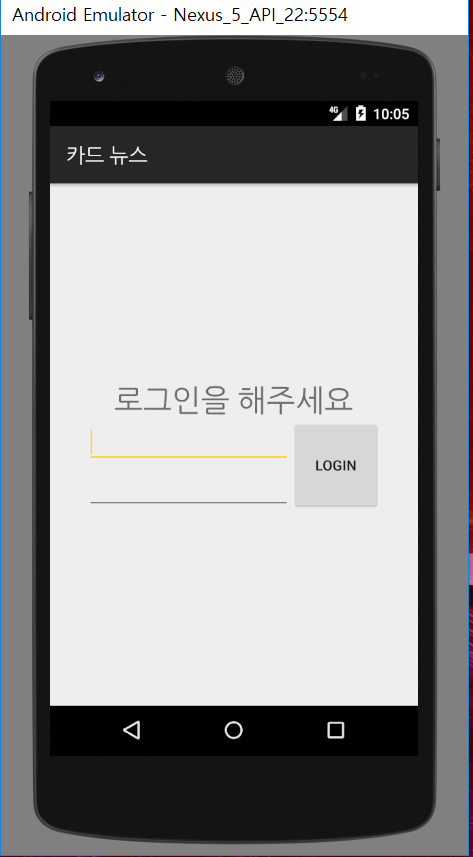
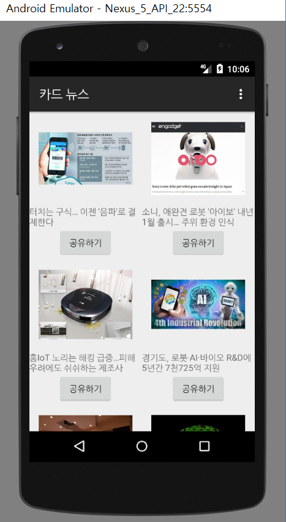
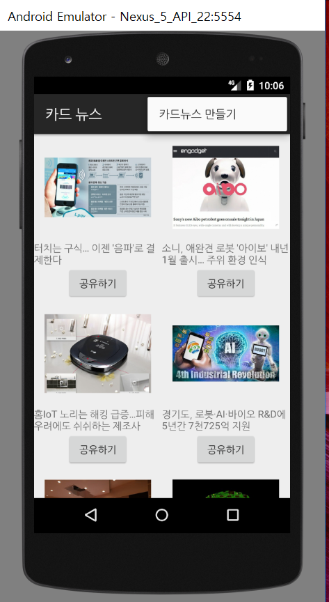
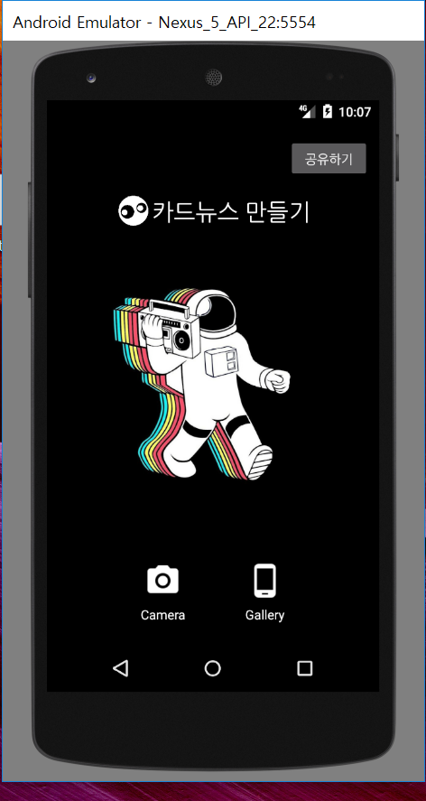
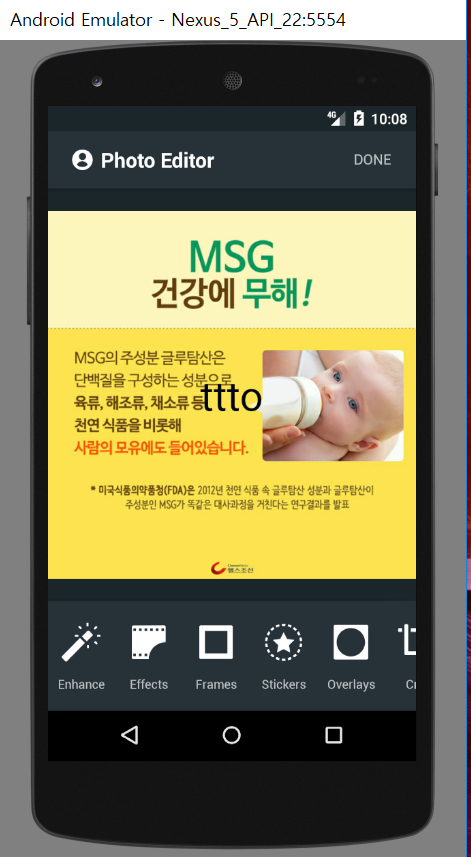

## IT 관련 뉴스를 보고 카드 뉴스를 제작하고 배포할수 있는 앱입니다.

#1. 로그인창

아이디와 비밀번호를 입력해 들어갈 수 있는 로그인 창입니다.

IT와 관련된 카드뉴스들을 볼 수 있습니다.

상단에 있는 "카드 뉴스 만들기"라는 메뉴를 클릭할 수 있습니다.

"카드 뉴스 만들기"를 클릭해서 나온 카드뉴스를 볼 수 있는 메뉴창입니다.

이곳에서 카드뉴스를 제작 사용자의 휴대폰 갤러리에 저장한 후, 그것을 통해 카드뉴스를 배포할 수 있습니다.
>>>>>>> d0e5586f3d0a6a4d411a833583c8126e72a33c2a
