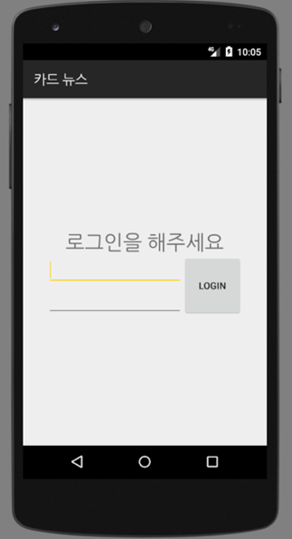
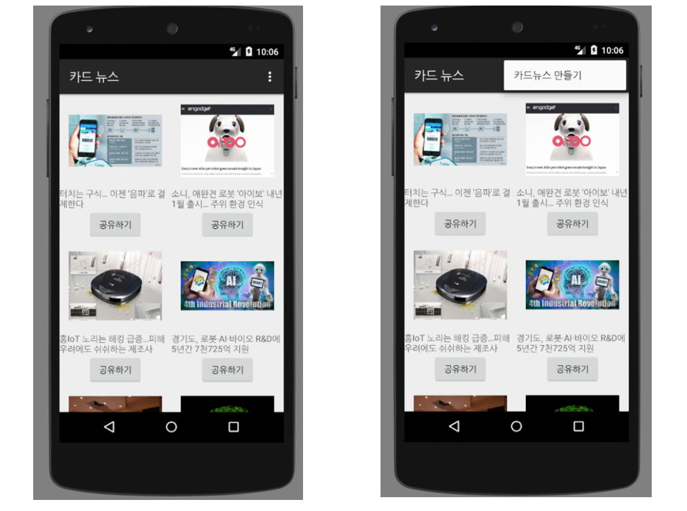

## IT 관련 뉴스를 보고 카드 뉴스를 제작하고 배포할수 있는 앱입니다.(App for watch IT news and make and publish cardnews)

#### 1. 로그인창(log-in window)

아이디와 비밀번호를 입력해 들어갈 수 있는 로그인 창입니다.(Log-in window that can enter username and password.)

#### 2. 메인창 (main window)

IT와 관련된 카드뉴스들을 볼 수 있습니다.(can watch the cardnews that realation to IT)

#### 3. 카드뉴스 에디터 창(cardnews editor window)

이곳에서 카드뉴스를 제작 사용자의 휴대폰 갤러리에 저장한 후, 그것을 통해 카드뉴스를 배포할 수 있습니다.
(can save the cardnews in the user's  cellphone gallery , and can publish through this.)

개발자를 위한 사양 설명서(specification manual for developers)
=======================

#### 안드로이드 스튜디오 사용(Use Android Studio)
    
  * Android studio를 사용하기 위한 사양(Specification to use Android Studio)
  
  
  
         OS : Microsoft Windows 10, 8.1, 8, 7 / Mac OS X 10.10 Yosemite ~ macOS 10.12 Sierra / GNOME or KDE Desktop(32-bit 어플리케이션 실행 가능 64-bit version)
      
         RAM : 최소 3GB, 권장 8GB
      
         하드디스크 : 2GB (스튜디오 자체) + 2GB (안드로이드 SDK, 에뮬레이터 시스템 이미지, 캐시)
      
         화면 해상도 : 최소 1280 x 800
      
         Java : Java Development Kit (JDK) 8
      
         에뮬레이터 가속(선택사항) : Intel® processor with support for Intel® VT-x , Intel® EM64T (Intel® 64) , Execute Disable (XD) Bit functionality
   
   * Android studio 3.0.1 for Windows version
  
   * Android virtual device는 5.1.1 lollipop 사용
   
   * Android SDK 사용

개발 참여 방법 안내
=======================

#### Pull requests를 환영한다.

#### commits를 하고 싶다면 메일을 보내주기 바란다.

  * E-mail adress : rlaslstjr@gmail.com
  
#### 들여쓰기는 4칸으로 정한다.

#### 띄어쓰기를 언더바로 대신한다.

#### Contributor를 원하면 메일을 보내주기 바란다.

  * E-mail adress : rlaslstjr@gmail.com
  
  
#### Welcome for Pull Requests

#### Please send mails, in case of commits

  * E-mail adress : rlaslstjr@gmail.com
  
#### 들여쓰기는 4칸으로 정한다.

#### 띄어쓰기를 언더바로 대신한다.

#### Please send mails, if you want to be Contributor

  * E-mail adress : rlaslstjr@gmail.com
  
MIT LISENCE 
=======================
Copyright (c) <2017> <purple-10>

Permission is hereby granted, free of charge, to any person
obtaining a copy of this software and associated documentation
files (the "Software"), to deal in the Software without
restriction, including without limitation the rights to use,
copy, modify, merge, publish, distribute, sublicense, and/or sell
copies of the Software, and to permit persons to whom the
Software is furnished to do so, subject to the following
conditions:

The above copyright notice and this permission notice shall be
included in all copies or substantial portions of the Software.

THE SOFTWARE IS PROVIDED "AS IS", WITHOUT WARRANTY OF ANY KIND,
EXPRESS OR IMPLIED, INCLUDING BUT NOT LIMITED TO THE WARRANTIES
OF MERCHANTABILITY, FITNESS FOR A PARTICULAR PURPOSE AND
NONINFRINGEMENT. IN NO EVENT SHALL THE AUTHORS OR COPYRIGHT
HOLDERS BE LIABLE FOR ANY CLAIM, DAMAGES OR OTHER LIABILITY,
WHETHER IN AN ACTION OF CONTRACT, TORT OR OTHERWISE, ARISING
FROM, OUT OF OR IN CONNECTION WITH THE SOFTWARE OR THE USE OR
OTHER DEALINGS IN THE SOFTWARE.

